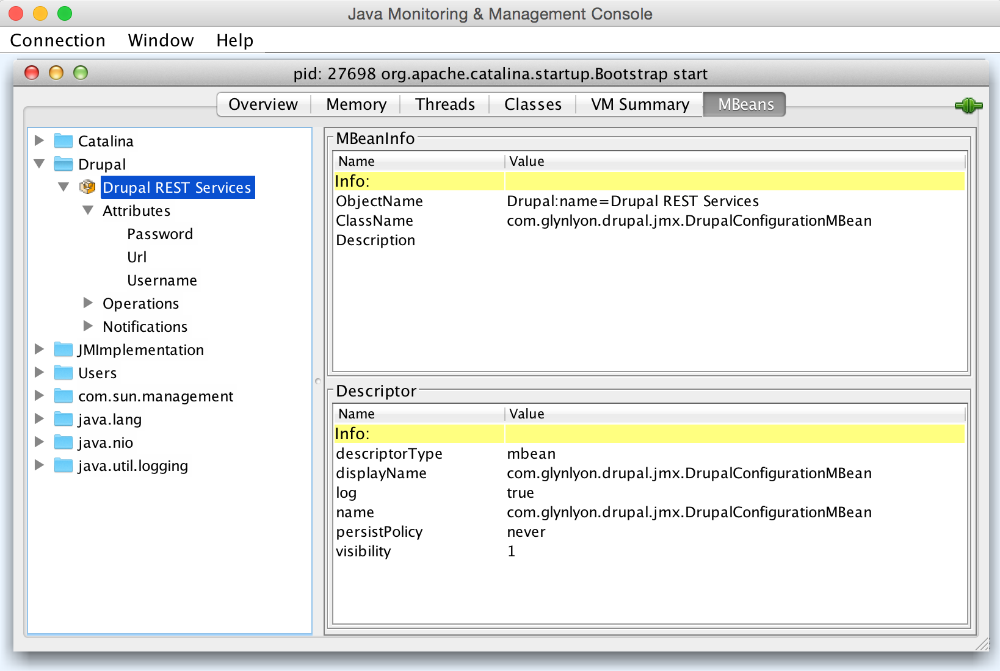
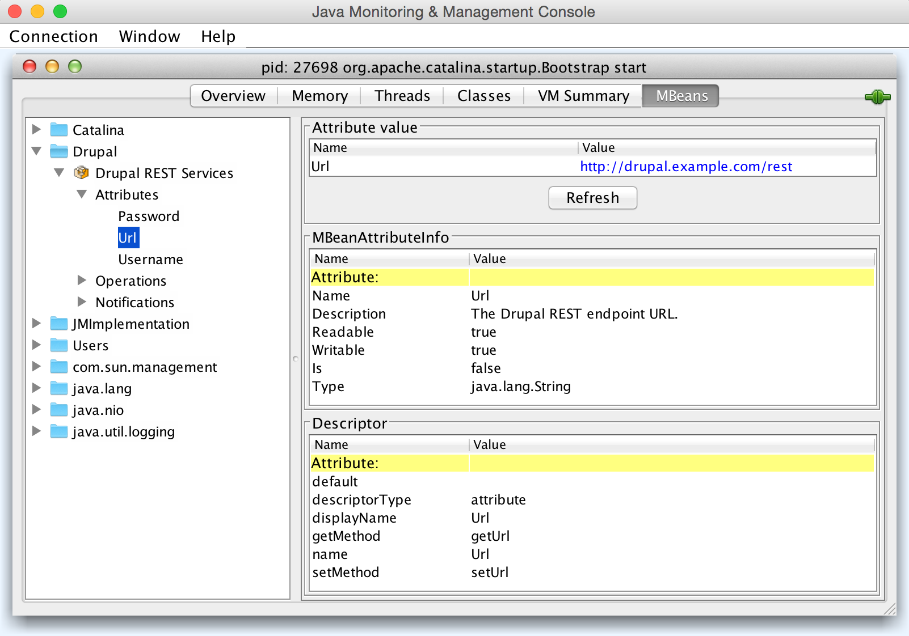
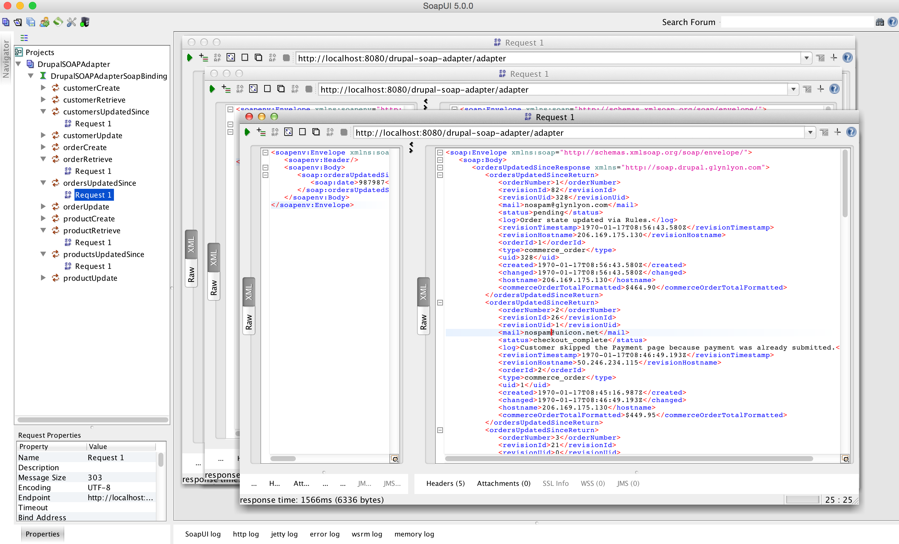
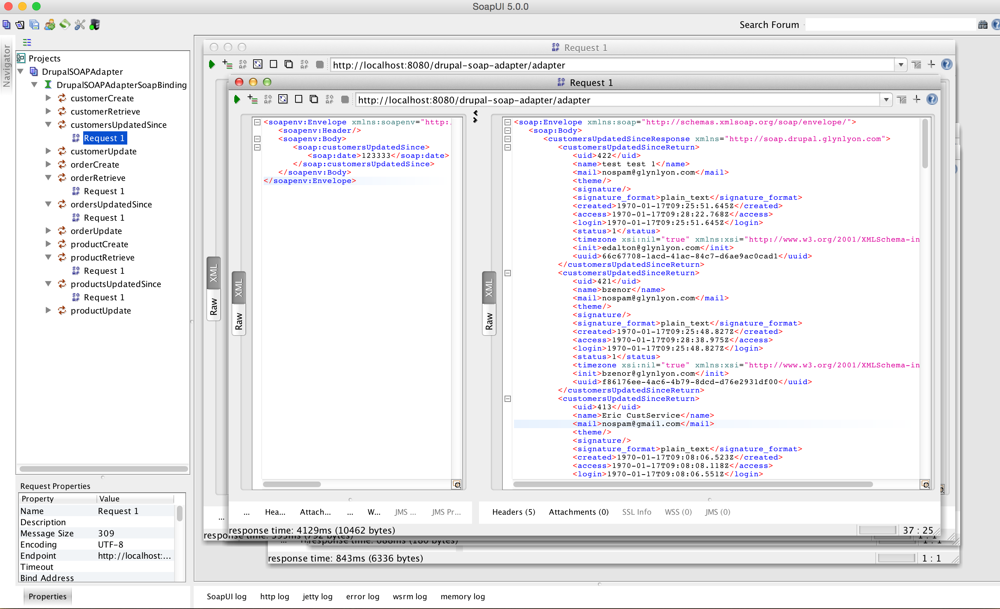

Drupal SOAP Adapter
====

This Java web application provides a statically-type SOAP WSDL and endpoint for accessing a [Drupal](https://www.drupal.org) system using the built-in REST capabilities of [Drupal's "Services" module](https://www.drupal.org/project/services). Support for the following resource types is included:

 * /product
 * /order
 * /user

Once deployed, this service effectively provides an "adapter" layer than sits in front of your Drupal instance. Configuration is done entirely via JMX, and may be set and changed an run-time without recompilation or redeployment of the .war.

Deployment Requirements
----
A recent Java webapp container (such as Tomcat) running on Java 7 or higher.

Deployment Quick Start
----

 * On a system with JRE 7 (or higher), install the container of your choice. Tomcat is recommended, though any of the popular containers should be fine.
 * Run `mvn package` to compile the .war file. You'll find it in the target/ directory. 
 * Deploy the .war to your container using whatever method floats your boat.
 * Configure the running application using jconsole, a command-line script, or other similar client. The properties you need to set are:
   * **Url** - e.g. http://localhost:8080/drupal-soap-adapter/adapter
   * **Username** - Drupal account with permissions to hit the REST API, e.g. "admin" 
   * **Password** - Password for that Drupal account, e.g. "password"
   
### ***Getting*** current attributes via Tomcat's HTTP JMX Proxy:
 * **URL**: http://hostname/manager/jmxproxy?get=Drupal:name=Drupal%20REST%20Services&att=Url
 * **Username**: http://hostname/manager/jmxproxy?get=Drupal:name=Drupal%20REST%20Services&att=Username
 * **Password**: http://hostname/manager/jmxproxy?get=Drupal:name=Drupal%20REST%20Services&att=Password

### ***Setting*** configuration via Tomcat's HTTP JMX Proxy:
 * **URL**: http://hostname/manager/jmxproxy?set=Drupal:name=Drupal%20REST%20Services&att=Url&val=http://drupal.example.com/rest
 * **Username**: http://hostname/manager/jmxproxy?set=Drupal:name=Drupal%20REST%20Services&att=Username&val=my_user
 * **Password**: http://hostname/manager/jmxproxy?set=Drupal:name=Drupal%20REST%20Services&att=Password&val=my_password

### Getting/Setting configuration via `jconsole`

If your setup is functioning correctly, you should see something like the following in SoapUI (or whatever SOAP client you're using):

Development
----
Project configuration files have been included for Eclipse, though any sane Java development will work. The project is built using:

 * Java 8 (but is set to compile for Java 7)
 * [Spring](http://projects.spring.io/spring-framework/) - Basic dependency injection and autowiring.
 * [Apache CXF](http://cxf.apache.org) - Generates Java model POJOs and SOAP wrapper classes based on the hand-crafted *.wsdl file.
 * [Apache HttpClient](http://hc.apache.org) w/Fluent - REST client libraries for crust-free calls.
 * [Jackson](https://github.com/FasterXML/jackson) - JSON unmarshalling/marshalling to/from POJOs.

Before you get hacking, note that all base SOAP class in the *.generated Java package(s) are _generated_ using the `mvn generate-sources` task, or _automatically_ when using a Maven-aware IDE. In other words, don't change these, because your modifications will be automatically overwritten when you least expect it. When using Eclipse, these classes will be regenerated any time the *.wsdl file changes. If you need to make a change to a model, either change the .wsdl or one of the implementation subclasses. That's what they're for.

For debugging SOAP operations, try [SoapUI](http://www.soapui.org) in conjunction with setting breakpoints in your IDE. The free version of SoapUI is sufficient.

The way Drupal generates JSON is... quirky... to say the least. Plan to play with the administrative settings of your Drupal instance during your adventure. Cheers!
 

Credits
----
You can blame this horrible idea on Preston Lee.

Legal
----
Copyright © 2014 Glynlyon, Inc. All rights reserved.
